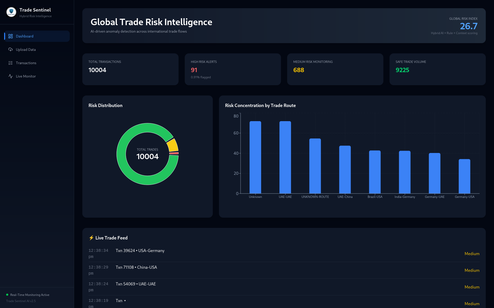
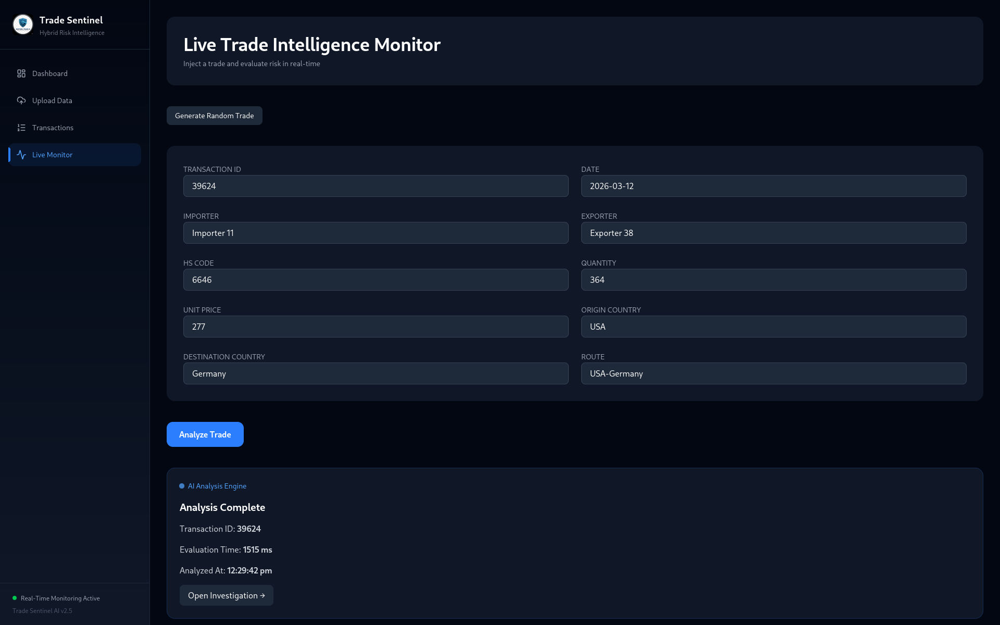
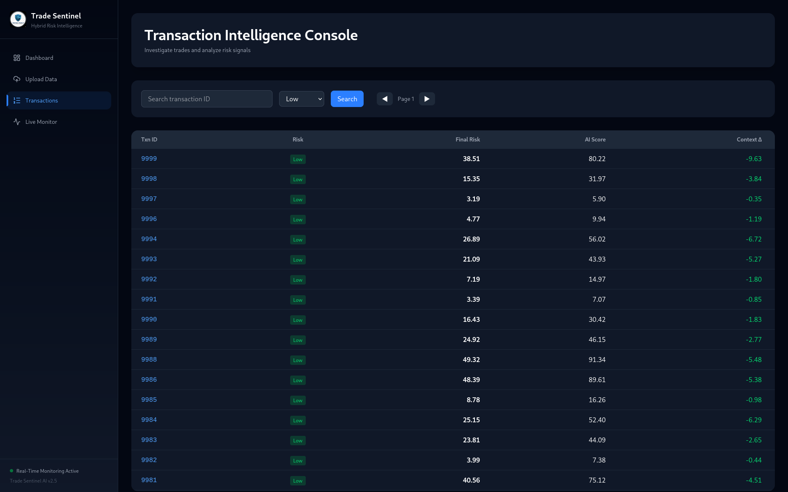
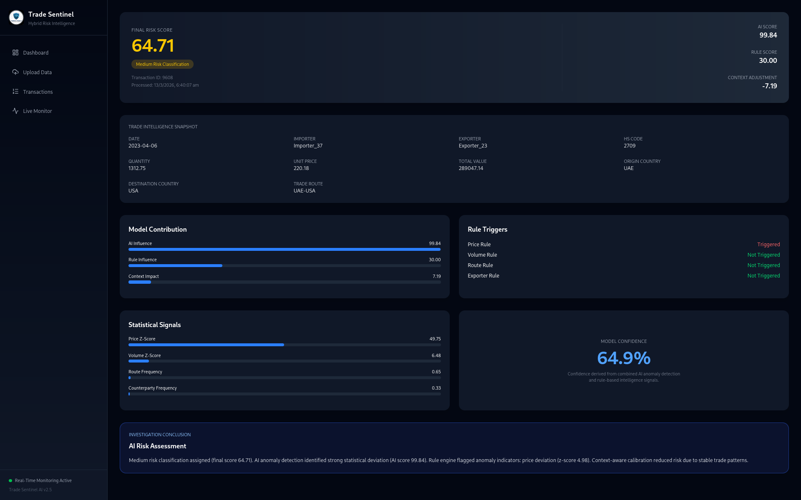

# 🌐 Trade Sentinel AI v2.5

[]()
[]()
[]()
[]()

> **Context-Aware Hybrid Trade Risk Intelligence Platform**
> Trade Sentinel AI is a hybrid anomaly detection system designed to identify suspicious transaction behavior using techniques aligned with modern threat detection systems. Legacy systems suffer from high false positives, static detection logic, and limited explainability. This project introduces a hybrid intelligence architecture that improves detection accuracy while maintaining operational efficiency.

---

## 🛡️ Cybersecurity & SOC Relevance

This system applies core detection engineering principles directly mirrored from Security Operations Center (SOC) environments:

* **Behavioral Anomaly Detection:** Functions similarly to UEBA (User and Entity Behavior Analytics) systems.
* **Signal Correlation:** Fuses AI outputs with a strict rule engine, mimicking SIEM detection pipelines.
* **Context-Aware Calibration:** Reduces false positives contextually, directly addressing alert fatigue challenges.
* **Explainable Risk Scoring:** Provides transparent metric breakdowns to support rapid investigation workflows.

---

## 📈 Performance & Impact

* **False Positive Reduction:** Reduced from **5,333 → 418 (~92% reduction)**.
* **Recall Rate:** Maintained **~99% recall** for critical anomalies.
* **Precision Improvement:** Increased from **~33% → 88%** after implementing context-aware calibration.
* **Scale:** Validated on **100,000+** transactions.

> **💡 Key Insight:** Initial hybrid modeling prioritized high recall, which caused precision to drop significantly (~33%). A context-aware calibration layer was engineered to reduce false positives without suppressing high-risk alerts, recovering precision while maintaining recall.

---

## ⚙️ Core Intelligence Pipeline

### 1. Feature Engineering
Ensures context-aware and product-specific anomaly detection:
* Price Z-score grouped by HS code
* Volume Z-score grouped by HS code
* Trade route frequency & Counterparty frequency

### 2. AI Model (Isolation Forest)
* Unsupervised anomaly detection requiring no labeled dataset.
* Highly efficient for parsing high-dimensional behavioral data.

### 3. Rule Engine (Compliance Signals)
Provides deterministic scoring based on hard thresholds. Score is capped at 100.

| Condition | Score Weight |
| :--- | :--- |
| **Price Z > 5** | +40 |
| **Price Z > 3** | +30 |
| **Volume Z > 5** | +30 |
| **Volume Z > 3** | +20 |
| **Rare Route** | +20 |
| **Rare Exporter** | +10 |

### 4. Hybrid Risk Scoring
Combines statistical deviations with deterministic rules:
`raw_risk = 0.6 * ai_score + 0.4 * rule_score`

| Risk Level | Threshold |
| :--- | :--- |
| 🔴 **High** | ≥ 75 |
| 🟡 **Medium** | ≥ 50 |
| 🟢 **Low** | < 50 |

### 5. Context Calibration
* High-risk alerts (≥ 75) are **never** suppressed.
* Medium/Low risks are dynamically adjusted based on behavioral stability (e.g., stable routes, established exporters).
* Maximum suppression is capped at 20% to prevent blind spots.

---

## 🖥️ Platform Interface & Features

| Feature | Description | Screenshot |
| :--- | :--- | :--- |
| **Risk Intelligence Dashboard** | Transaction metrics, risk distribution, and global risk index feeds. |  |
| **Live Trade Intelligence Monitor** | Manual transaction injection with real-time hybrid risk evaluation. |  |
| **Transaction Console** | Searchable intelligence database with risk classification filtering. |  |
| **Investigation Engine** | Explainable summaries showing AI contributions and rule triggers. |  |

---

## 🏗️ Cloud-Native Architecture

The repository is built for enterprise-scale deployments, cleanly separating application source code from Kubernetes infrastructure:

*   **`apps/`**: The core Trade Sentinel application (FastAPI & React) and load generators.
*   **`infrastructure/`**: Kubernetes deployments, StatefulSets, and Prometheus/Loki configurations.
*   **`telemetry/`**: Structured JSON metrics and logs captured from failure simulations.
*   **`services/`**: Feature Engineering extensions.

---

## 🛠️ Tech Stack

| Component | Technologies |
| :--- | :--- |
| **Backend API & ML** | `FastAPI`, `Python`, `Scikit-learn`, `Pandas`, `NumPy` |
| **Database** | `SQLAlchemy`, `SQLite` / `PostgreSQL` |
| **Frontend UI** | `React`, `Vite`, `Tailwind CSS`, `Recharts`, `Framer Motion` |
| **Infrastructure** | `Kubernetes`, `Docker`, `Helm`, `Prometheus`, `Loki` |

---

## 🚀 Setup & Installation

### Option A: Local Development

**1. Backend Setup**
```bash
cd apps/trade-sentinel/backend
python -m venv venv
source venv/bin/activate
pip install -r requirements.txt
```
Create a `.env` file in the backend directory:
```env
DATABASE_URL=sqlite:///./trade.db
```
Start the API:
```bash
uvicorn app.main:app --reload
```
*API running at [http://127.0.0.1:8000](http://127.0.0.1:8000) | Docs at `/docs`*

**2. Frontend Setup**
```bash
cd apps/trade-sentinel/frontend
npm install
npm run dev
```
*Frontend running at [http://localhost:5174](http://localhost:5174)*

### Option B: Kubernetes Deployment (Production / Enterprise)

This project uses an NGINX Ingress Controller to manage internal routing. You do not need to port-forward any pods.

**1. Start the cluster and enable Ingress**
```bash
minikube start
minikube addons enable ingress
```

**2. Deploy the Infrastructure**
```bash
# 1. Deploy the Prometheus/Loki Observability Stack via Helm (Optional)
# 2. Deploy the Trade Sentinel Application (includes the Ingress resource)
kubectl apply -f infrastructure/kubernetes/trade-sentinel/
```

**3. Map the Local Domain**
Because the Ingress controller routes traffic based on the hostname `trade-sentinel.local`, you must map this domain to your Minikube cluster IP. 

Run this command to find your Minikube IP and append it to your hosts file:
```bash
echo "$(minikube ip) trade-sentinel.local" | sudo tee -a /etc/hosts
```
*Note: If you get a "DNS address could not be found" error in your browser, it means this step was skipped or your browser hasn't recognized the hosts file change yet.*

**4. Access the Platform**
Open your browser and navigate to:
👉 **[http://trade-sentinel.local](http://trade-sentinel.local)**

*(The Ingress Controller will automatically route `/` to the React frontend and `/api/*` to the FastAPI backend!)*

**5. Tear Down / Stop the Cluster**
When you are finished testing, you can cleanly shut down the entire environment and free up your computer's CPU and RAM by stopping Minikube.
```bash
minikube stop
```
*(When you want to run it again, just run `minikube start` and everything will instantly resume exactly where you left off!)*

---

## 👤 Author

**Sai Shashank P**
*SOC Analyst* | *System Engineer*

---
*MIT License. Copyright (c) 2026 Sai Shashank.*
